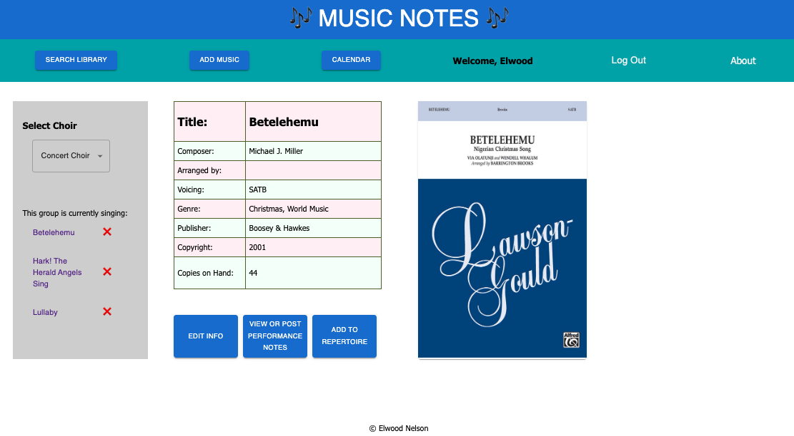
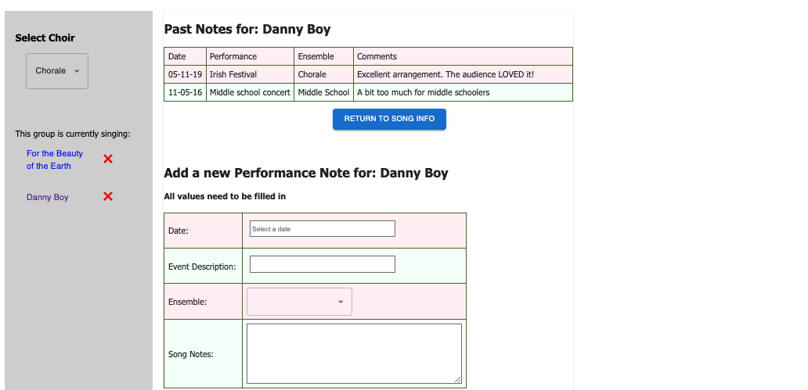

# Music Notes


## Overview
This was a 2-week Solo Project!

In the choral world of massive cabinets full of paper music, Music Notes is an app for Choir teachers and students to digitally search their school's music library, have quick access to song details, keep the inventory up to date, and have one place to look at scheduled events. 

## Features
- Search the database of music by title, composer, arranger, voicing, and genre.
  

- Look at the details of each song also including publisher, copyright date, and quantity on hand.
  

- View the songs currently being used by each ensemble.
- View a Google Calendar associated with the school's choral department

Additionally, teachers (admin users) can also
- Edit each detail of a piece of music
- Edit the active song list for each ensemble
- View and Add notes about each song's performance(s)
  


## Installation
After downloading this repo, open the folder using your terminal and run:
```$ ~ npm install```

- in PostgreSQL, create a database named music_notes and execute the queries in database.sql
- Create a `.env` file at the root of the project and paste this line into the file:

```plaintext
SERVER_SESSION_SECRET=superDuperSecret
```

While you're in your new `.env` file, take the time to replace `superDuperSecret` with some long random string like `25POUbVtx6RKVNWszd9ERB9Bb6` to keep your application secure. Here's a site that can help you: [Password Generator Plus](https://passwordsgenerator.net). 

-Start the server and client in their own terminal tabs
```$ ~ npm run server```
```$ ~ npm run client```

-Navigate to http://localhost:5173 


## Built With
- React
- Node.js
- Redux, Sagas
- PostgreSQL
- Material UI


## Author
Elwood Nelson


## Acknowledgements
My instructors at Prime Digital Academy - Matthew Black, Dane Smith
and also my colleagues in the Pinnacles Cohort - 
  Jennifer Her, Emma Molden, Ben Pollock,  
  Daniel Richter, and Brii Swordlegz

