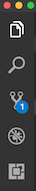
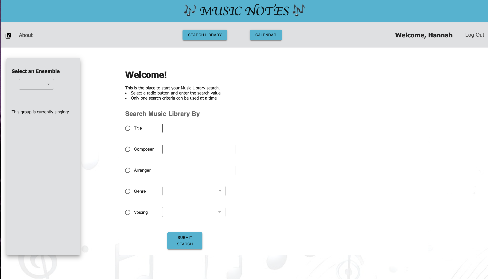
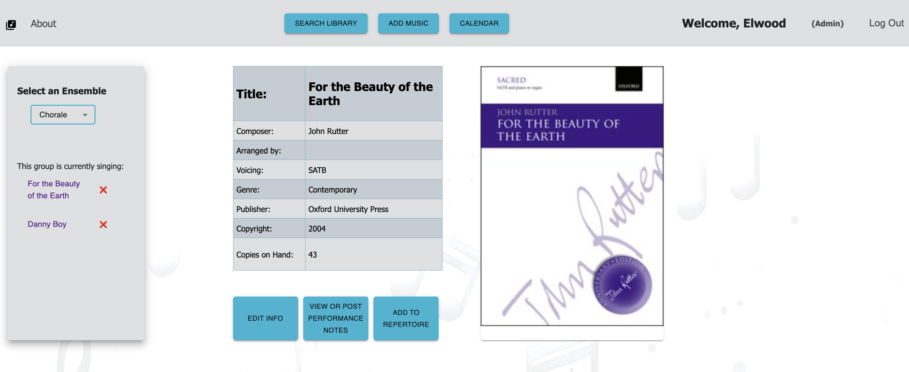

# Music Notes


## Overview
This was a 2-week Solo Project!

In the choral world of massive cabinets full of paper music, Music Notes is an app for Choir teachers and students to digitally search their school's music library, have quick access to song details, keep the inventory up to date, and have one place to look at scheduled events. 

## Features
- Search the database of music by title, composer, arranger, voicing, and genre.
- Look at the details of each song also including publisher, copyright date, and quantity on hand.
- View the songs currently being used by each ensemble.
- View a Google Calendar associated with the school's choral department

Additionally, teachers (admin users) can also
- Edit each detail of a piece of music
- Edit the active song list for each ensemble
- View and Add notes about each song's performance(s)
- Add new music pieces to the school's music database


## Installation
After downloading this repo, open the folder using your terminal and run:
```$ ~ npm install```

- in PostgreSQL, create a database named music_notes and execute the queries in database.sql
- Create a `.env` file at the root of the project and paste this line into the file:

```plaintext
SERVER_SESSION_SECRET=superDuperSecret
```

While you're in your new `.env` file, take the time to replace `superDuperSecret` with some long random string like `25POUbVtx6RKVNWszd9ERB9Bb6` to keep your application secure. Here's a site that can help you: [Password Generator Plus](https://passwordsgenerator.net). 

-Start the server and client in their own terminal tabs
```$ ~ npm run server```
```$ ~ npm run client```

-Navigate to http://localhost:5173 


## Development Setup Instructions


## Debugging

To debug, you will need to run the client-side separately from the server. Start the client by running the command `npm run client`. Start the debugging server by selecting the Debug button.



Then make sure `Launch Program` is selected from the dropdown, then click the green play arrow.


## Testing Routes with Postman


## Production Build

Before pushing to Heroku, run `npm run build` in terminal. This will create a build folder that contains the code Heroku will be pointed at. You can test this build by typing `npm start`. Keep in mind that `npm start` will let you preview the production build but will **not** auto update.

- Start postgres if not running already by using opening up the [Postgres.app](https://postgresapp.com), or if using [Homebrew](https://brew.sh) you can use the command `brew services start postgresql`.
- Run `npm start`.
- Navigate to `localhost:5173`.


## Deployment

1. Create a new Heroku project.
1. Link the Heroku project to the project GitHub Repo.
1. Create an Heroku Postgres database.
1. Connect to the Heroku Postgres database from Postico.
1. Create the necessary tables.
1. Add an environment variable for `SERVER_SESSION_SECRET` with a nice random string for security.
1. In the deploy section, select manual deploy.

## Update Documentation

Customize this ReadMe and the code comments in this project to read less like a starter repo and more like a project. Here is an example: https://gist.github.com/PurpleBooth/109311bb0361f32d87a2.

Student View - search start


Teacher (admin) view - song info
